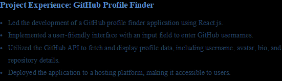
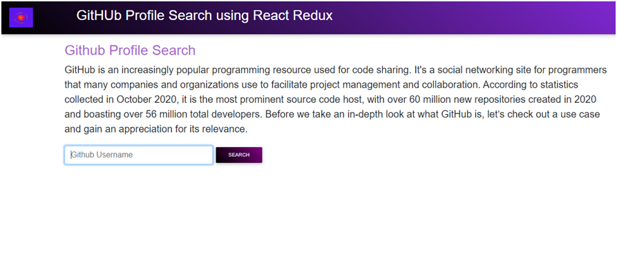
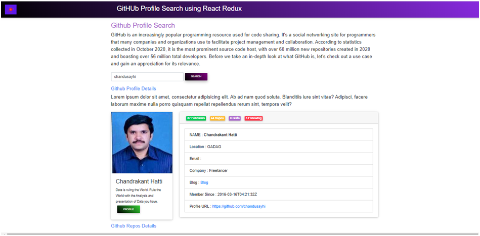
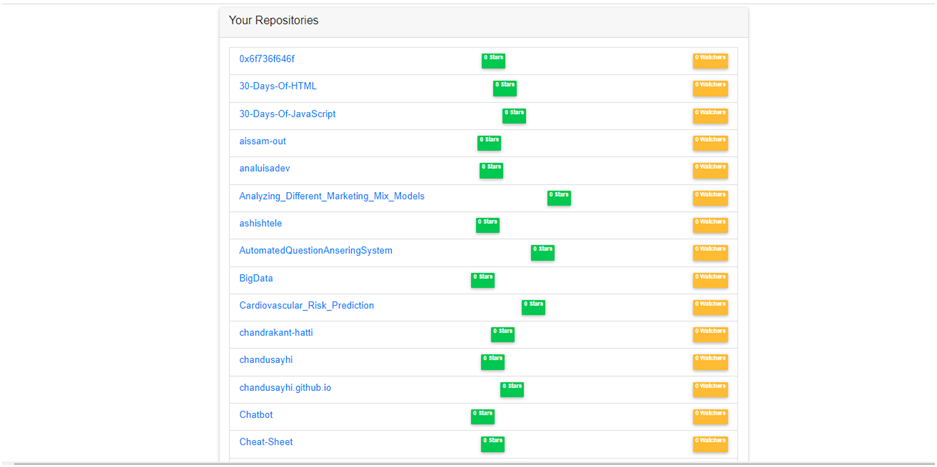
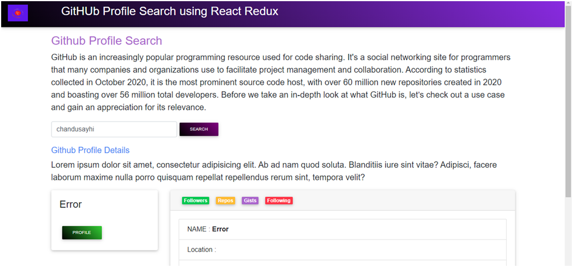

# GITHUB PROFILE SEARCH

GitHub is an increasingly popular programming resource used for code sharing. It's a social networking site for programmers that many companies and organizations use to facilitate project management and collaboration. According to statistics collected in October 2020, it is the most prominent source code host, with over 60 million new repositories created in 2020 and boasting over 56 million total developers.

## A GitHub Use Case

Let’s consider the case of Decathlon, the world’s largest sporting goods retail brand. The company has over 1600 stores in 57 countries, with more than 87,000 employees.

Every company, no matter how large or small, inevitably experiences challenges and obstacles. We could best summarize Decathlon’s problems as:

How would the company maintain workflow visibility and avoid redundancies in such a large workforce?
How would the company hire developers for so many diverse locations?
GitHub to the rescue! GitHub is not only an affordable resource but also features a great open-source community. Since it is a cloud-based tool, the code is conveniently visible across the entire client organization, facilitating every participant's contributions.

GitHub allows collaboration with developers from all over the world. Open-source solutions like GitHub enable potential developers to contribute and share their knowledge to benefit the global community.

The version control system, or VCS, is the element in Git that is best suited for tackling Decathlon’s two problems. So, let’s expand our knowledge of GitHub by taking a closer look at the Git version control system and see why it’s such a game-changer.

## PROJECT EXPERIENCE

## OUTPUT SCREEN SHOT

